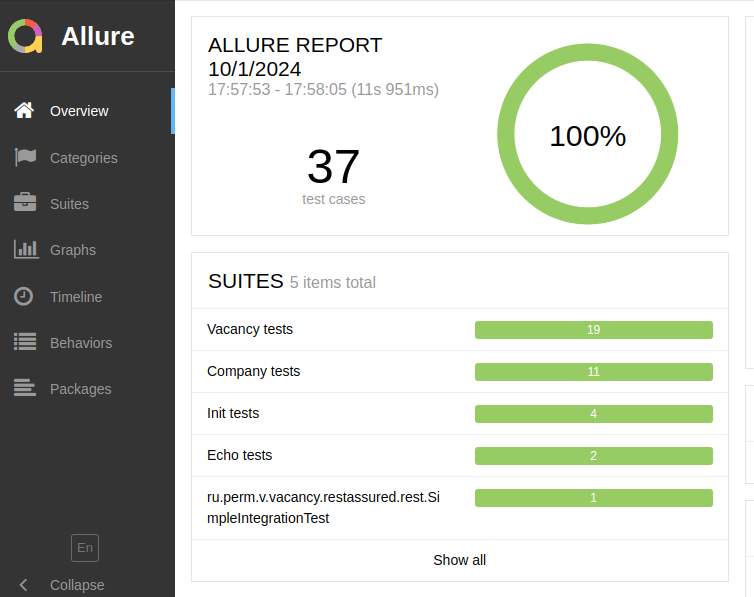
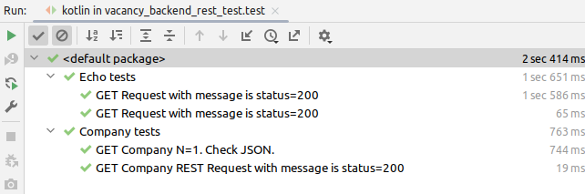
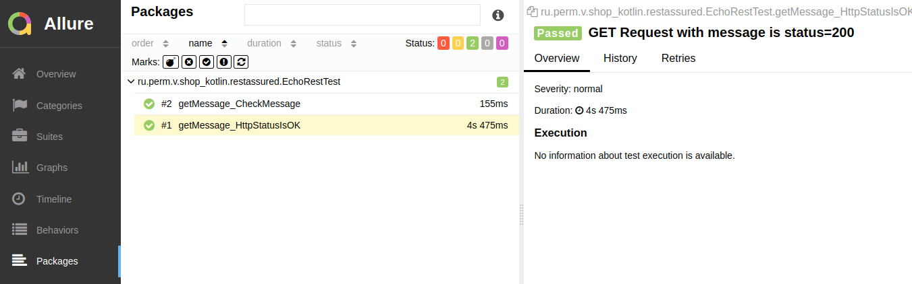
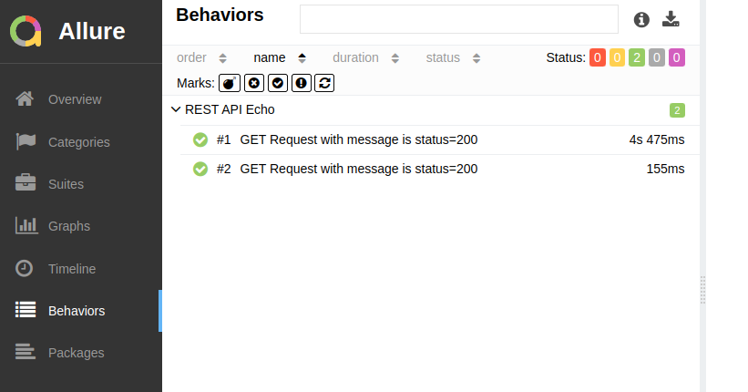
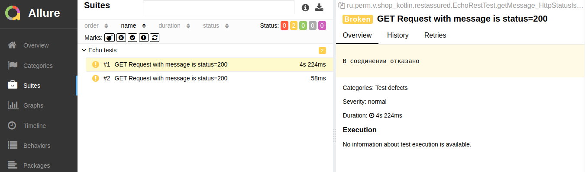

### Behave тестирование с помощью RestAssured проекта vacancy_backend

Тестируемый проект [https://github.com/cherepakhin/vacancy_backend](https://github.com/cherepakhin/vacancy_backend)

Для проведения тестов использован RestAssured<br/>
 [https://github.com/rest-assured/rest-assured](https://github.com/rest-assured/rest-assured/wiki/GettingStarted).

Для просмотра отчетов Allure [https://docs.qameta.io/allure/](https://docs.qameta.io/allure/)

Скрипты выполнять из папки проекта с тестами Rest Assured. 
Перед запуском тестов нужно запустить сам проект:
[https://github.com/cherepakhin/vacancy_backend](https://github.com/cherepakhin/vacancy_backend)

### Env переменные

Константы (адрес сервиса, REST пути и т.п.) заданы в [src/test/kotlin/ru/perm/v/vacancy_backend/restassured/CONST.kt](https://github.com/cherepakhin/vacancy_backend_reastassured_test/blob/dev/src/test/kotlin/ru/perm/v/vacancy_backend/restassured/CONSTS.kt):

````kotlin
class CONSTS {
 companion object {
  val VACANCY_KOTLIN_IP = System.getenv("VACANCY_KOTLIN_IP") ?: "127.0.0.1:8980"
  val HOST = "http://"+VACANCY_KOTLIN_IP +"/vacancy_backend/api"
  val ECHO_PATH = HOST + "/echo/"
  val GROUP_PATH = HOST + "/group_product/"
  val PRODUCT_PATH = HOST + "/product/"
 }
}
````

VACANCY_KOTLIN_IP - адрес и порт сервиса. По умолчанию: __127.0.0.1:8980__. Установка переменных:

````shell
$ export VACANCY_KOTLIN_IP=127.0.0.1:8980
$ echo $VACANCY_KOTLIN_IP
127.0.0.1:8980
````

Для указания RestAssured в тестах необходимо настроить __RestAssured.baseURI__:

````kotlin
@DisplayName("Echo tests")
class EchoRestTest {
    val MESSAGE = "MESSAGE"

    companion object {
        @BeforeAll
        @JvmStatic
        fun setupAll(): Unit {
// Для справки:
//     class CONSTS {
//      companion object {
//       val IP = System.getenv("VACANCY_KOTLIN_IP") ?: "127.0.0.1:8980"
//       val HOST = "http://"+IP +"/vacancy/api"
//       val ECHO_PATH = HOST + "/echo/"
//       val COMPANY_PATH = HOST + "/company/"
//      }
//     }
            RestAssured.baseURI = CONSTS.ECHO_PATH
        }
    }

    @Test
    @Epic("REST API Echo")
    @DisplayName("GET Request with message is status=200")
    fun getMessage_HttpStatusIsOK() {
        given().`when`().get(CONSTS.ECHO_PATH + MESSAGE).then()
            .statusCode(HttpStatus.SC_OK)
    }
}
````

### Проведение теста

```shell
vacancy_backend-restassured-test$ ./gradlew test
```

Просмотр отчета в браузере:

```shell
vacancy_backend_restassured_test$ allure serve build/allure-results/
```

### Результаты behave тестирования



В Idea названия тестов будут названы из аннотации  @DisplayName. Пример:

```java
    @Test
    @Epic("REST API Echo")
    @DisplayName("GET Request with message is status=200")
    fun getMessage_HttpStatusIsOK() {
        given().`when`().get(MESSAGE).then()
            .statusCode(HttpStatus.SC_OK)
    }

```



### Памятка по группировке тестов allure

Пример:

```java
@Tag("name_project")
@Epic("REST API ")
@DisplayName("Display name test") 
@Story("Story requests test")
@Feature("Verify CRUD Operations")
public class RestTest {
 
}

```

По пакетам:



По цели (@Epic("REST API Echo")):


Тесты на **НЕ ЗАПУЩЕННОМ** сервисе:


### Шпаргалка по вложенности


Подробнее можно посмотреть в проекте (https://github.com/cherepakhin/shop_kotlin)[https://github.com/cherepakhin/shop_kotlin]

### Закладки

https://docs.qameta.io/allure/
https://allure-framework.github.io/allure-demo/5/#suites/a2891ce60e520f56ae25e6caf68ea773/448aea45096280d4/

~/prog/java/allure-examples/allure-junit5

````shell
vacancy_backend-restassured-test$ cd ~/<catalog project>
vacancy_backend-restassured-test$ mvn clean test
vacancy_backend-restassured-test$ allure serve allure-results/
````

### Grafana

Вообще, Grafana используется для мониторинга работающего приложения, здесь только для интереса. Какие-то общие сведения можно увидеть на тестах. В конфигурацию Prometheus добавить задание:


Timeout(10s)


### Примечания.

При возникновении ошибки:

````shell
Error: Could not find or load main class org.gradle.wrapper.GradleWrapperMain Caused by: java.lang.ClassNotFoundException: org.gradle.wrapper.GradleWrapperMain
````

Выполнить:

````shell
gradle wrapper
````

Для исправления **warning**: _java.lang.NoSuchMethodError: 'org.junit.platform.engine.UniqueId org.junit.platform.launcher.TestIdentifier.getUniqueIdObject()'_ нужно указать правилные версии тестовых библиотек junit, jupiter: 

````shell
...
testImplementation("org.junit.jupiter:junit-jupiter-api:5.8.0-M1")
testImplementation("org.junit.jupiter:junit-jupiter-engine:5.8.0-M1")
testImplementation("org.junit.platform:junit-platform-launcher:1.8.0-M1")
testImplementation("org.junit.platform:junit-platform-runner:1.8.0-M1")
...
````